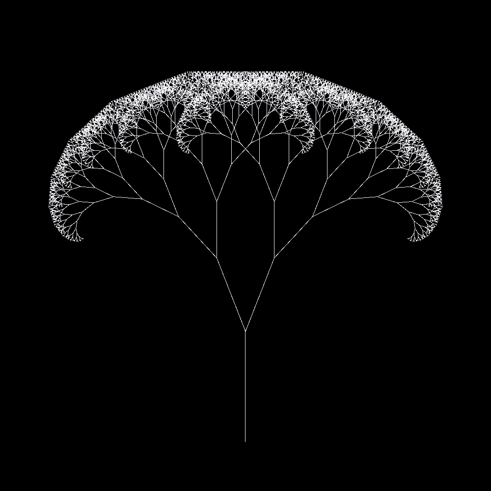

# **Cpp Recursive Trees**

---
## **Description**
---
This is a personal project of mine designed to generate recursive tree patterns. At the moment it can only generate one pattern, given different parameters such as length of base line, angle between lines, depth, etc... The program will  generate and render the tree onto a window. Doesn't do much at this point. Most of the code is an unoptimised unorganized mess and needs some clean up.
## **Purpose**
---
The purpose for making this was to teach myself how to operate VSCode as well as
learn git and some practice with OpenGl. I figured I'd just do a personal project
and learn everything that way.
## **Building**
---
Uses [MinGW-w64](https://www.mingw-w64.org/downloads/) g++ (64-bit) to compile and link project. There are 2 tasks in [tasks.json](.vscode/tasks.json), one for compiling and linking, one for running. The compile task will use powershell and use the `g++` command with arguments required to compile and link it. All dependencies are included with the project.
## **Branches**
---
- **master**

At the current moment, uses **OpenGl** to render the generated tree.
- **sdl**

Uses **sdl** to render the generated tree.
## **Contact Me**
---
*<jo.launchpad@gmail.com>*
\
\
***Have a nice day! :)***